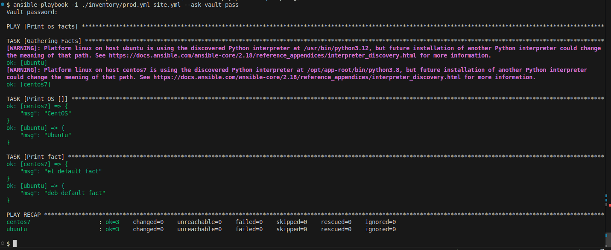
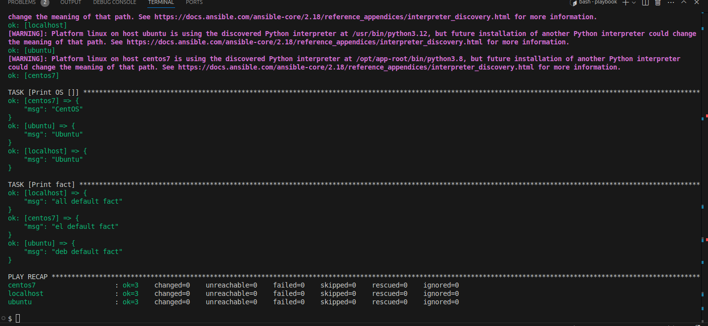

## 

### 1. 


### 2.

playbook/group_vars/all/example.yml
```
---
  some_fact: all default fact

```


### 3-4

не совсем понял про подготовленное окружение, развернул два контейнера


### 5-6

не уверен, что правильно понял задание


### 7-8

дошел до дополнительных заданий и замневался, тут нужно было шифровать файл или конкретные значения?!



### 9

### 10

```
  local:
    hosts:
      localhost:
        ansible_connection: local
```

### 11



