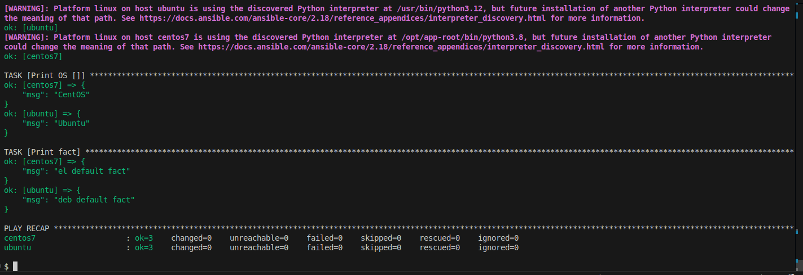

## 


```bash
$ ansible-lint site.yml
```


-----------------------

```bash
$ ansible-playbook -i inventory/prod.yml site.yml --check
```


-----------------------

```bash
$ ansible-playbook -i inventory/prod.yml site.yml --diff
```
1.

2.
